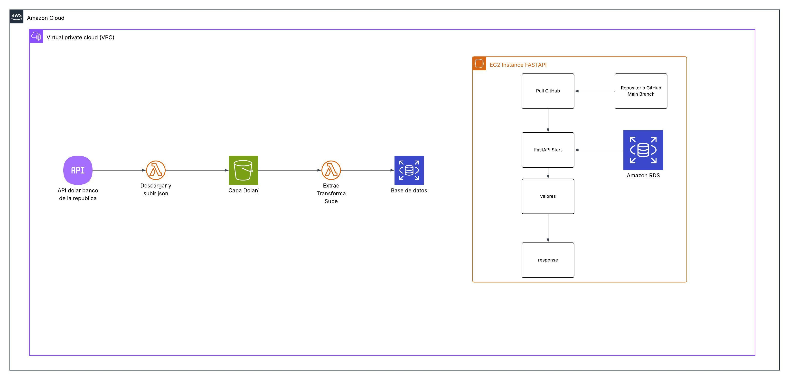

# Zappa Dólar: Data Ingestion Pipeline

Este repositorio contiene una infraestructura de **Ingeniería de Datos** diseñada para la ingesta automatizada, el procesamiento (ETL) y la exposición de indicadores financieros. El sistema utiliza una arquitectura **Event-Driven** sobre AWS para garantizar escalabilidad y eficiencia en el manejo de datos.

## Diagrama de Arquitectura

El siguiente esquema describe el flujo de datos desde la fuente externa hasta la capa de consumo final:



---

## Flujo de Ingeniería (Data Lifecycle)

De acuerdo con la arquitectura desplegada, el pipeline gestiona el dato en tres fases críticas:

### 1. Etapa de Ingestión (Data Ingestion)

* **Origen:** API REST del Banco de la República.
* **Mecanismo:** Una función AWS Lambda se encarga de descargar el recurso y realizar el **upload** del JSON al bucket de S3.
* **Destino:** **Amazon S3 (Capa Dólar)**, que actúa como el repositorio de datos crudos (Landing Zone).

### 2. Etapa de Procesamiento y Carga (ETL)

* **Trigger:** Notificación automática de evento desde el bucket S3 hacia la segunda Lambda.
* **Transformación:** La función realiza la extracción del JSON, la normalización de tipos de datos y la preparación de la carga.
* **Persistencia:** Almacenamiento final en la base de datos **Amazon RDS (MySQL)**.

### 3. Etapa de Consumo (Serving Layer)

* **Tecnología:** **FastAPI** ejecutándose sobre una instancia **Amazon EC2**.
* **Despliegue:** Integración continua que realiza un `git pull` desde la rama `main` de GitHub para actualizar la lógica de consulta.
* **Interacción:** La API consulta la base de datos para generar respuestas estructuradas al usuario final.

---

## Organización del Proyecto

* `Zappa_Code/` → Componentes del Pipeline: Extracción (`dolar.py`) y carga (`db_loader.py`).
* `Api/` → Capa de Servicio: Backend encargado de la entrega y filtrado de datos.
* `Test/` → Calidad de Software: Suite de validación con mocks de AWS y DB.
* `zappa_settings.json` → Orquestación de la infraestructura serverless.

---

## Estrategia de Calidad y Pruebas

Se implementan pruebas automatizadas para garantizar la integridad del flujo:

* **Mocks de S3:** Uso de `moto` para validar la subida de archivos sin peticiones reales.
* **Inyección de Dependencias:** Uso de `FakeConnection` para testear la lógica de base de datos de forma aislada.

```bash
pytest -v

```

---

## CI/CD y Automatización

El flujo de despliegue está automatizado mediante **GitHub Actions**:

1. **Test:** Ejecución de pruebas unitarias y de integración.
2. **Lambda Deploy:** Actualización de funciones serverless mediante **Zappa**.
3. **EC2 Deploy:** Actualización de la API FastAPI y reinicio del servicio vía SSH.

---

##  Referencia de la API

**POST** `/valores`

```json
{
  "fecha_inicio": "2025-09-01 07:00:00",
  "fecha_fin": "2025-09-01 09:00:00"
}

```

---

## Integrantes y Roles

* **Gustavo Takashi:** Desarrollo del Backend (API FastAPI), Pruebas Unitarias y lógica de consulta.
* **Daniel Varela:** Arquitectura de infraestructura AWS, Ingeniería de Datos (Pipeline ETL), Configuración de Zappa  y Pipeline de CI/CD.

---
